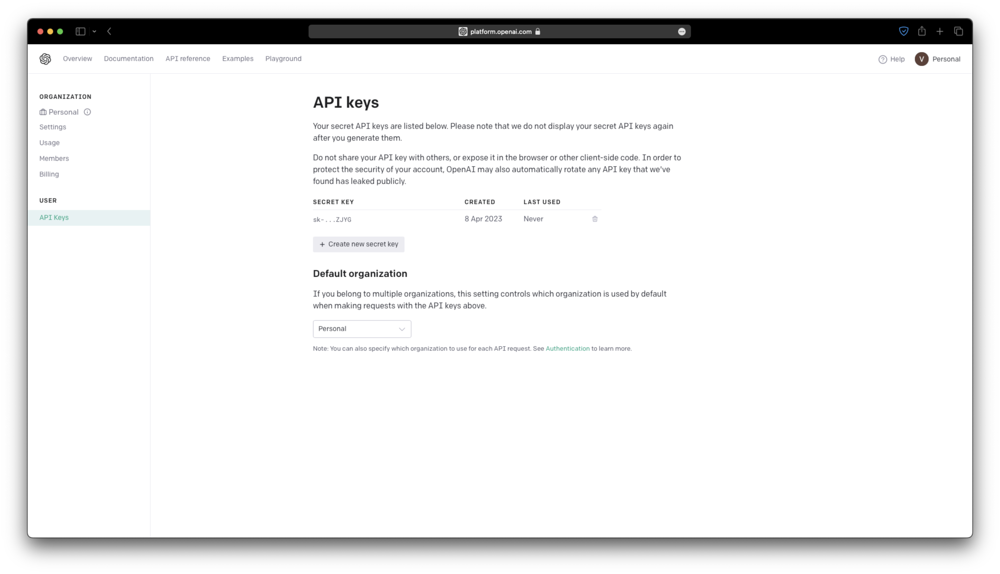

# Obsidian Weaver

Weaver is a useful [Obsidian](https://obsidian.md) plugin that integrates ChatGPT/GPT-3 into your note-taking workflow. This plugin makes it easy to access AI-generated suggestions and insights within Obsidian, helping you improve your writing and brainstorming process.

# Note

Please note that Weaver is currently in beta and there may be bugs or issues that need to be addressed. While I have thoroughly tested the plugin, it is possible that unexpected problems may arise. As with any software, it is always a good idea to backup your data before using a new plugin.

# Features

The current implementation of the plugin offers the following features:

- New Chat Creation: You can easily create a new chat session with the AI assistant by clicking the "plus" button within Obsidian.
- AI Assistance: Once you have created a new chat session, you can ask the AI assistant any questions and receive instant responses. This makes it easy to get information and insights on any topic, without having to leave the Obsidian environment.

These features provide a foundation for the plugin and offer a simple yet powerful way to access AI-generated suggestions and insights within Obsidian. I am always working to improve the plugin and add new features, so stay tuned for updates and improvements in the future!

# Why should you use this?
## Respecting the philosophy of Obsidian

At the core of Obsidian's philosophy is the idea of storing notes locally, allowing users to have complete control over their data. Weaver respects this philosophy by storing all chats locally in a `.bson` format, ensuring that your data remains secure and private. With Weaver, you can use the power of AI to enhance your note-taking experience without sacrificing privacy or control over your data.

## What sets this apart from other GPT-like plugins in Obsidian?

What sets Weaver apart from other GPT-like plugins in Obsidian is its unique integration with the Obsidian interface and functionality. While other plugins may replicate the ability to generate text from a prompt, they do not offer the same level of integration and ease of use as Weaver.

This integration not only makes the writing process more efficient, but it also helps you stay focused and on track, as you don't have to switch between different applications or interfaces. With Weaver, you can stay within the Obsidian environment and take advantage of all the features and tools that Obsidian has to offer, making the writing and brainstorming process more enjoyable and productive.

# Installation

The plugin is not yet available in the plugin library, will be soon. Stay tunned.

## Manual

1.  Go to the [releases](https://github.com/vasilecampeanu/obsidian-weaver/releases) and download `main.js`, `manifest.json`, and `styles.css` of the latest version.
2.  Put the files in `YourObsidianVault/.obsidian/plugins/obsidian-weaver/`
3.  Reload the plugins in Obsidian settings or restart the program.
4.  The plugin can now be enabled in the plugins menu.

## Brat

You can also install Weaver using the community plugin [obsidian42-brat](https://github.com/TfTHacker/obsidian42-brat).

# Getting Started with Obsidian Weaver

Here is a step-by-step guide on how to get started with Obsidian Weaver:

## Obtaining an OpenAI API Key

In order to use Obsidian Weaver, you will need to obtain an API key from [OpenAI](https://platform.openai.com). You can sign up for an API key on the OpenAI website. Once you have obtained your API key, you will be able to use it to access OpenAI's GPT-3 models.

## Choosing a Model

Once you have obtained an API key, you will need to choose which GPT-3 model you would like to use. Currently, Obsidian Weaver supports multiple models, each with its own strengths and capabilities. Please note that the GPT-4 model is not yet available to the public, and to use it, you will need to request access to it.

## Configuration

Obsidian Weaver allows you to configure the AI model to suit your specific needs. You can adjust the maximum number of tokens generated, the temperature, and the frequency penalty. These settings can be adjusted to control the level of creativity and specificity of the AI-generated responses.

- Maximum Number of Tokens Generated: This setting determines the maximum number of tokens (i.e. words or phrases) that the AI model will generate in response to a prompt. By adjusting this setting, you can control the length of the AI-generated responses.
- Temperature: This setting controls the level of creativity and randomness in the AI-generated responses. A higher temperature will result in more creative and diverse responses, while a lower temperature will result in more specific and accurate responses.
- Frequency Penalty: This setting adjusts the frequency of the AI-generated responses. A higher frequency penalty will result in more common and frequently used responses, while a lower frequency penalty will result in more unique and uncommon responses.

# Future Features and Improvements

Obsidian Weaver is constantly evolving, and we are always looking for ways to improve the plugin and add new features. Some of the features and improvements that we are currently working on or planning to implement in the future include:

- Threads: similar to folders, but containing lists of messages. This will allow you to better organize your conversations and find the information you need more easily.
- Search: The ability to search through messages in a chat session and through threads, making it easier to find the information you need.
- Context Awareness: The ability for the plugin to be aware of the note that the user is working on, providing more relevant and context-specific responses.
Internet Search: The ability to perform internet searches within the plugin, similar to what Big Chat does.
- Note Suggestions: The ability to offer suggestions for notes based on the current chat session, making it easier to create new notes and organize your information.
- Internet Search: The ability to perform internet searches within the plugin, similar to what Big Chat does.
- Embeddings: The ability to generate and use embeddings to improve the performance of the AI model.
- Multiple Models: The ability to choose between multiple AI models, allowing you to select the best model for your specific needs.
- ChatGPT API: Future support for the ChatGPT API release, allowing you to access the latest and most advanced AI models.

# Development Schedule

As a student, I am working on this project in my free time. While I am dedicated to improving the plugin and adding new features, the development process may take some time. I am constantly working to improve the plugin and add new features, but please be patient as I balance my studies and other responsibilities.

If you have any suggestions for new features or improvements, your input is invaluable to the development process. To share your ideas, please consider opening an issue on the plugin's GitHub repository. This allows you to provide detailed feedback and suggestions in a centralized location, where they can be easily tracked and discussed. Your contributions will help me prioritize new features and improvements and ensure that the plugin meets the needs of its users.

# Special Thanks and Recognition

- [obsidian-textgenerator-plugin](https://github.com/nhaouari/obsidian-textgenerator-plugin)
- [obsidian-ava](https://github.com/louis030195/obsidian-ava)
- [chatgpt-md](https://github.com/bramses/chatgpt-md)
- [makemd](https://github.com/Make-md/makemd)
